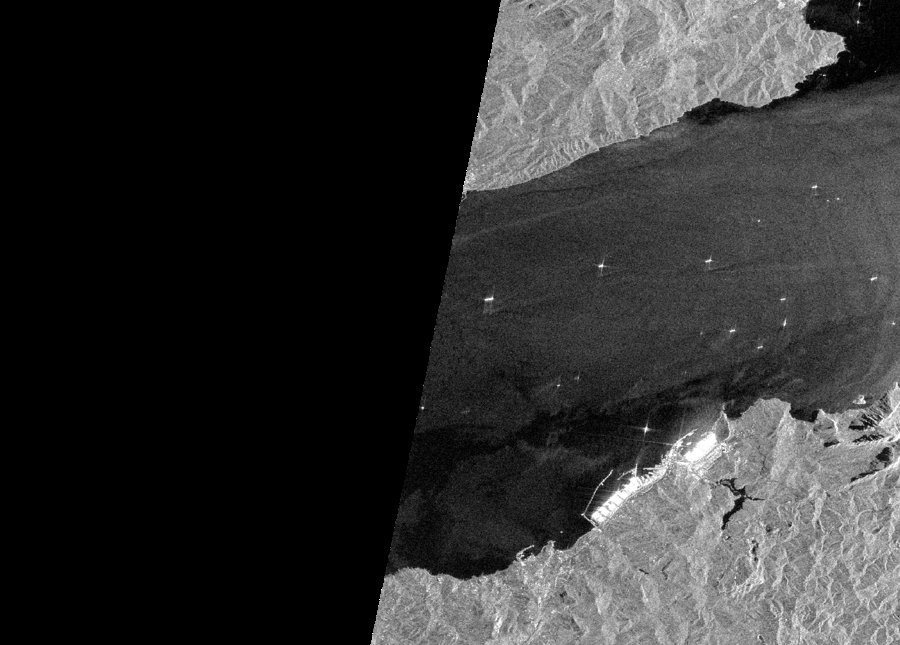
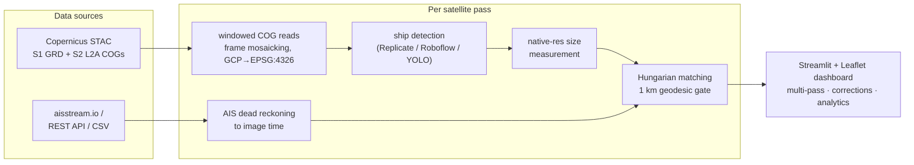

# sat_tracker — Dark Vessel Detection

Find ships that don't want to be found. **sat_tracker** fuses Sentinel-1
radar imagery with live AIS tracking data to surface **dark vessels** —
ships visible on satellite radar that are not broadcasting their position —
and puts the result on an interactive map with human-in-the-loop review.


*Sentinel-1 VV backscatter over the Strait of Gibraltar. Bright crosses on
dark water are ships. Contains modified Copernicus Sentinel data.*

## What it does

- **Finds every Sentinel-1 pass** over your area of interest and streams
  only the needed pixels (windowed COG reads — no scene downloads).
- **Detects ships** with the [xView3 challenge](https://iuu.xview.us/)
  2nd-place model — purpose-built for exactly this problem — including
  per-vessel **length estimation**, served pay-per-second on Replicate
  (a full pass costs a few cents; scale-to-zero, no idle cost).
- **Records AIS continuously** from [aisstream.io](https://aisstream.io)
  (free) for every area you bookmark, in one lightweight process.
- **Fuses radar × AIS**: dead-reckons every AIS track to the exact image
  timestamp (WGS84 geodesics), solves the optimal detection↔track
  assignment (Hungarian algorithm, 1 km gate), and classifies each target:
  🔵 verified (radar + AIS) · 🟢 AIS-only (broadcasting, not imaged) ·
  🔴 **dark** (imaged, silent).
- **Measures ship sizes** (~length × beam + axis orientation) from
  native-resolution radar chips, independent of detector backend.
- **Interactive review**: multi-pass navigation, Sentinel-2 optical context
  overlay, click-to-delete false positives, click-to-link missed matches,
  draw-on-map areas of interest with named bookmarks, per-pass corrections
  with an exportable audit trail (usable as retraining labels).
- **Honest by design**: per-pass AOI-coverage %, AIS time-alignment
  diagnostics with root-cause messages, a data-source health panel, and an
  unmissable red banner on anything simulated.

## Quick start

```bash
git clone https://github.com/gSulpizio/sat_tracker && cd sat_tracker
cp .env.example .env        # fill in the three credentials below
docker compose up -d --build
# → http://localhost:8501
```

Or without Docker: `pip install -r requirements.txt`, then
`streamlit run app/streamlit_app.py`. Every setting (including all
credentials) can also be entered in the app's ⚙️ Pipeline configuration
panel, which persists them to `data/user_config.json` (git-ignored,
0600) across restarts.

To try it with zero credentials: pick **simulate** mode in the config
panel — a synthetic scene + AIS traffic with known ground truth, rendered
under a large SIMULATED banner.

## Credentials you need (all free to obtain)

| What | Where | Used for |
|---|---|---|
| CDSE **S3 keys** | [eodata-s3keysmanager.dataspace.copernicus.eu](https://eodata-s3keysmanager.dataspace.copernicus.eu) (free Copernicus account) | streaming Sentinel-1/-2 imagery windows. Note: this is a *different* credential than the CDSE OAuth client. |
| aisstream.io key | [aisstream.io](https://aisstream.io) | live AIS recording. Free terrestrial feed — coverage is volunteer-receiver based and has regional gaps; the app tells you when a gap, not a dark fleet, explains an all-dark pass. |
| Replicate token | [replicate.com/account/api-tokens](https://replicate.com/account/api-tokens) | ship detection. Billed to your account per second of CPU: ~$0.03–0.05 per satellite pass at typical AOI sizes. |

## Detection backends

The default is **`replicate`**, pointing at
[`gsulpizio/xview3-vessel-detect`](https://replicate.com/gsulpizio/xview3-vessel-detect)
— a public deployment of the xView3 2nd-place model (Selim Seferbekov's
TimmUnet-resnet34, Apache-2.0). It consumes native-resolution VV+VH chips
and returns, per target: position, vessel/non-vessel classification, and
length in metres. You only need your own Replicate token.

Prefer full control? The complete Cog package is in `replicate_xview3/`
(weights are **not** in this repo — the model is fetched from the
[official challenge release](https://github.com/selimsef/xview3_solution/releases/tag/weights)):

```bash
curl -L -o replicate_xview3/model.bin \
  https://github.com/selimsef/xview3_solution/releases/download/weights/val_only_TimmUnet_resnet34_77_xview
cd replicate_xview3
docker login r8.im -u <your-replicate-username>   # password = API token
cog push r8.im/<your-username>/<model-name>
```

Other backends, selectable in the app: `roboflow` (hosted API, works with
any model you train there or public Universe models), `yolo` (local
YOLOv8-OBB — see training notes below), `vertex` (Google Cloud endpoint),
and `mock` (simulate mode only).

## How it works



Key mechanics worth knowing:

- **Frame mosaicking**: one overpass arrives as several rotated frame
  files; they're grouped (≤120 s apart) and mosaicked so your AOI isn't a
  sliver. The per-pass "% imaged" indicator tells you when the swath
  genuinely missed part of your box.
- **Time alignment is guaranteed by construction**: AIS is fetched
  ±window around *each pass's own* acquisition time, and every snapshot
  carries a `time_alignment` block the UI turns into plain-language
  diagnoses ("this pass predates your AIS recording" vs "receiver gap").
- **Detections are cached per (scene, detector, AOI)**: re-running a pass
  is free — only fusion re-runs against the ever-growing AIS store.
- **Pseudo-calibration**: CDSE GRD DNs are uncalibrated; chips are
  anchored by their 30th-percentile backscatter to typical calm-sea σ0.
  Within a couple of dB of true calibration, which is enough for the
  model's 15 dB input window — but see limitations.

## Repository layout

```
app/streamlit_app.py        dashboard (map, corrections, config panel)
backend/pipeline.py         per-pass orchestration + caching
backend/ingestion/          STAC/COG reader · AIS providers · AIS collector
backend/detection/          detector backends behind one interface
backend/fusion/matcher.py   dead reckoning + Hungarian assignment
backend/measurement.py      native-res ship size estimation
backend/diagnostics.py      data-source health checks
replicate_xview3/           Cog package for the detection model
db/schema.sql               optional PostGIS persistence schema
```

## Deploying behind a reverse proxy

Set `SAT_TRACKER_BIND=127.0.0.1:8501` (or join the container to your
proxy's docker network) so the dashboard isn't reachable except through
your auth layer — the UI can trigger billable API calls, so don't leave
it open. Streamlit needs websocket pass-through (`Upgrade`/`Connection`
headers). The AIS collector must run 24/7 to be useful: it can only
record traffic while it's running, and history can't be backfilled from
the free feed.

## Limitations — read before trusting results

- **This is a research/OSINT tool, not evidence.** A "dark vessel" flag
  means: radar target, no matching AIS within the gate/window. Causes
  include AIS receiver gaps (common on the free terrestrial feed), small
  craft with no AIS carriage requirement, and detector false positives.
- Radiometric calibration is approximated (percentile anchoring), and
  georeferencing uses GCP warping without terrain correction — fine over
  open water, degraded near steep coastlines.
- Size estimates are ±10–25 m at Sentinel-1 resolution; anchored clusters
  can merge; bow/stern is ambiguous in the axis estimate.
- Free AIS history starts when *your* collector starts. For retroactive
  or dependable coverage, use a commercial AIS provider via the `rest`
  backend, or public historical archives (US: NOAA MarineCadastre).
- Not for navigation or safety-of-life use.

## Training your own detector (optional)

Public SAR ship datasets: [xView3-SAR](https://iuu.xview.us/) (closest to
this task — includes dark-vessel labels), HRSID, SSDD/LS-SSDD. For a local
YOLOv8-OBB: 1024 px tiles with overlap, dB chips with 2–98 percentile
stretch to uint8, `yolo obb train model=yolov8m-obb.pt imgsz=1024
degrees=180 mosaic=0.5`, then point the `yolo` backend at the weights.

## License & attribution

- Code: [MIT](LICENSE).
- `replicate_xview3/unet.py` is vendored from
  [selimsef/xview3_solution](https://github.com/selimsef/xview3_solution)
  (xView3 2nd place) under
  [Apache-2.0](replicate_xview3/LICENSE) — thank you, Selim Seferbekov.
- Imagery: *contains modified Copernicus Sentinel data*, courtesy of the
  [Copernicus Data Space Ecosystem](https://dataspace.copernicus.eu/).
- AIS: [aisstream.io](https://aisstream.io) community feed.
- The xView3 challenge by the [Defense Innovation Unit](https://iuu.xview.us/)
  created the dataset and task this project's detector descends from.
