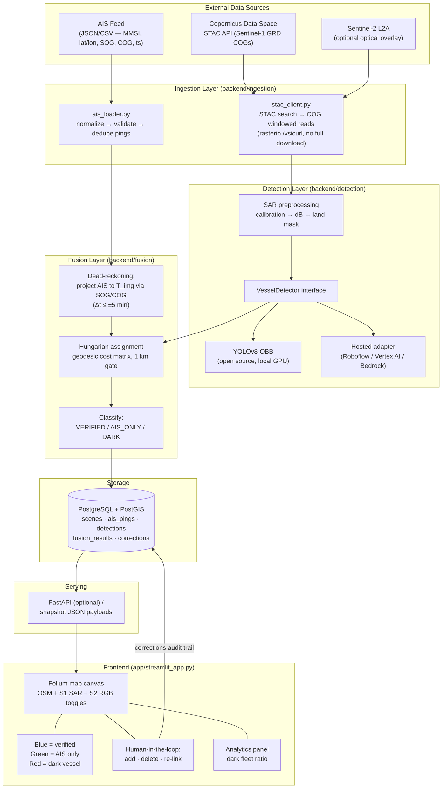

# sat_tracker — Dark Vessel Detection Platform

Fuses Sentinel-1 SAR imagery with AIS tracking data to surface **dark vessels**:
ships visible on radar that are not broadcasting AIS. Includes a web GIS
dashboard with human-in-the-loop correction (add / delete / re-link targets).

---

## Step 1 — System Architecture & Data Flow



**Data flow summary**

1. A STAC query against the Copernicus Data Space Ecosystem returns Sentinel-1
   GRD scenes intersecting the AOI/time window; imagery is read as COG windows
   (`rasterio` over `/vsicurl/`) so only the AOI pixels are transferred.
2. SAR chips are preprocessed (σ⁰ calibration, dB scaling, coastline land
   masking) and passed to the `VesselDetector` interface — either a local
   YOLOv8-OBB model or a hosted inference API, selected by config.
3. AIS pings within ±5 min of the scene timestamp are dead-reckoned to the
   image acquisition time using each vessel's SOG/COG.
4. A Hungarian (linear sum assignment) solve matches radar detections to
   projected AIS positions on a geodesic-distance cost matrix, gated at 1 km.
5. Results are classified **VERIFIED** (blue), **AIS_ONLY** (green),
   **DARK** (red), persisted to PostGIS, and served to the dashboard.
6. Analyst corrections (add / delete / re-link) are written back as an audit
   trail and can be exported as training labels for model fine-tuning.

---

## Repository Layout

```
sat_tracker/
├── backend/
│   ├── config.py                 # env-driven settings
│   ├── pipeline.py               # Step 2: end-to-end fusion pipeline (entry point)
│   ├── ingestion/
│   │   ├── stac_client.py        # Copernicus STAC search + COG reads (+ offline simulator)
│   │   └── ais_loader.py         # AIS CSV/JSON ingestion + mock generator
│   ├── detection/
│   │   ├── base.py               # VesselDetector interface + Detection dataclass
│   │   ├── yolo_sar.py           # YOLOv8-OBB open-source implementation
│   │   └── hosted_api.py         # Roboflow / Vertex AI drop-in adapters
│   └── fusion/
│       └── matcher.py            # dead reckoning + Hungarian matching
├── app/
│   └── streamlit_app.py          # Step 3: interactive GIS dashboard
├── db/
│   └── schema.sql                # PostGIS schema
├── data/                         # generated snapshots + rendered SAR overlay
└── requirements.txt
```

## Quick Start

```bash
python -m venv .venv && source .venv/bin/activate
pip install -r requirements.txt

streamlit run app/streamlit_app.py
```

**Every option is configurable in the app** (sidebar → ⚙️ Pipeline
configuration): data mode, detector backend, temporal window, match gate,
AOI bbox, AIS provider, STAC catalog/collection, and credentials. Hit
**▶ Run pipeline** to fetch, detect, fuse, and render.

**Configuration persists between sessions:** every run saves the full panel
(credentials included) to `data/user_config.json`, and the app — and the
CLI — start from it next time. The file is git-ignored (all of `data/` is)
and written with `0600` permissions since it holds API secrets. A
*Clear saved config* button in the panel deletes it.

### Multi-pass snapshots

The pipeline processes **every Sentinel-1 pass** found in the search window
(up to *Max passes per run*) and writes one snapshot per pass to
`data/snapshots/`. The dashboard navigates between passes with **◀ / ▶** —
each pass carries its own scene, its own AIS window (fetched ±Δt around that
pass's acquisition time), its own fusion result, and its own analyst
corrections (edits persist while navigating).

### AIS providers (API instead of manual upload)

| Provider | What it is | Setup |
|---|---|---|
| `store` (default) | Local recording fed by the **aisstream.io collector daemon**. Live AIS can't be queried retroactively on free tiers, so you record continuously and the pipeline queries the recording per pass. | `pip install websockets`, free key from aisstream.io, then run `python -m backend.ingestion.ais_collector --bbox -6.2 35.75 -5.3 36.2` as a daemon |
| `rest` | One HTTP call per pass to a historical AIS API (Datalastic, Spire, in-house). | Set the URL template (placeholders `{min_lon} {min_lat} {max_lon} {max_lat} {start_iso} {end_iso}`) + API key in the app |
| `file` | Manual CSV/JSON upload — fallback. An uploaded file always overrides the API, and the scene search window is derived from its time coverage. | Upload in the sidebar |

### Live mode (default) — real data only

- Uses the configured AIS provider automatically. For imagery from the
  default Copernicus Data Space catalog you need **CDSE S3 keys**
  (`CDSE_S3_KEY` / `CDSE_S3_SECRET`, generated at
  [eodata-s3keysmanager.dataspace.copernicus.eu](https://eodata-s3keysmanager.dataspace.copernicus.eu))
  — the GRD-COG assets are streamed from `s3://eodata`. The OAuth client
  (`CDSE_CLIENT_ID` / `CDSE_CLIENT_SECRET`) is only needed for catalogs
  serving token-protected HTTPS assets. GRD-COG products carry ground
  control points; the reader warps them to EPSG:4326 on the fly (accurate
  over ocean).
- Per pass, AIS is fetched for ±Δt around that scene's acquisition time, so
  image time and AIS time coincide by construction. Each snapshot's
  `time_alignment` block records T_img vs. AIS coverage and how many
  pings/vessels are usable; the dashboard shows an error banner if empty.
- Requires a real detector backend (`yolo` needs `pip install ultralytics`
  + trained weights; or `roboflow` / `vertex` with API credentials). The
  mock detector is rejected in live mode.

```bash
python -m backend.pipeline                                  # AIS from store/API
python -m backend.pipeline --ais fleet_export.csv           # AIS from a file
```

### Simulate mode — testing only

Fabricates a synthetic scene + AIS traffic with known ground truth. All
outputs are unmistakably labeled: `scene_id` starts with `SIMULATED_`, the
payload carries `"simulated": true`, and the dashboard renders a large red
**⚠ SIMULATED DATA ⚠** banner.

```bash
python -m backend.pipeline --mode simulate                  # mock detector
python -m backend.pipeline --mode simulate --ais old.csv    # scene time auto-aligns to the file
```

## Docker Deployment

Two long-running services (`docker-compose.yml`), built from one shared image:

- **`sat-tracker`** — the Streamlit dashboard. A plain idle web server; the
  only heavy work (imagery download, detector API calls) runs on-demand
  when an analyst clicks ▶ Run pipeline, never on a schedule.
- **`sat-tracker-collector`** — the AIS websocket listener
  (`backend/ingestion/ais_collector.py`). Needs to run continuously since
  fusion depends on a ping history, but it's idle almost all the time
  (waiting on the socket) — negligible CPU, tens of MB of RAM.

Both carry hard `mem_limit`/`cpus` ceilings so neither a heavy manual
pipeline run nor a runaway process can starve the host.

```bash
docker compose up -d --build
```

Config (`data/user_config.json`, credentials, `data/locations.json`,
the AIS store, cached snapshots) lives on a bind-mounted volume — set
`SAT_TRACKER_DATA_DIR` or edit the `volumes:` path in `docker-compose.yml`
to point at wherever that should persist on the host. The collector reads
its watch area and API key from env vars (`AOI_BBOX`, `AIS_API_KEY`) via
an `.env` file next to the data directory, since it has no
`user_config.json` of its own to read the dashboard's active location
from — if you actively monitor more than one location, duplicate the
`sat-tracker-collector` service block with a different `AOI_BBOX` per
area so AIS keeps recording for all of them.

## Model Training Notes (YOLOv8-OBB for SAR)

Public SAR ship datasets suitable for fine-tuning:

| Dataset | Sensor | Notes |
|---|---|---|
| **xView3-SAR** | Sentinel-1 GRD | Largest; includes dark-vessel labels — closest to this task |
| **HRSID** | S1 + TerraSAR-X | High-res, OBB-friendly |
| **SSDD / LS-SSDD** | Sentinel-1 | Classic benchmark; LS variant is full-scene |

Recommended recipe (see `backend/detection/yolo_sar.py` docstring for the
exact commands): start from `yolov8m-obb.pt`, convert SAR dB chips to 8-bit
with a 2–98 percentile stretch, tile scenes to 1024×1024 with 128 px overlap,
train ~100 epochs, then calibrate the confidence threshold against a held-out
scene so precision ≥ 0.9 before enabling auto-flagging.
